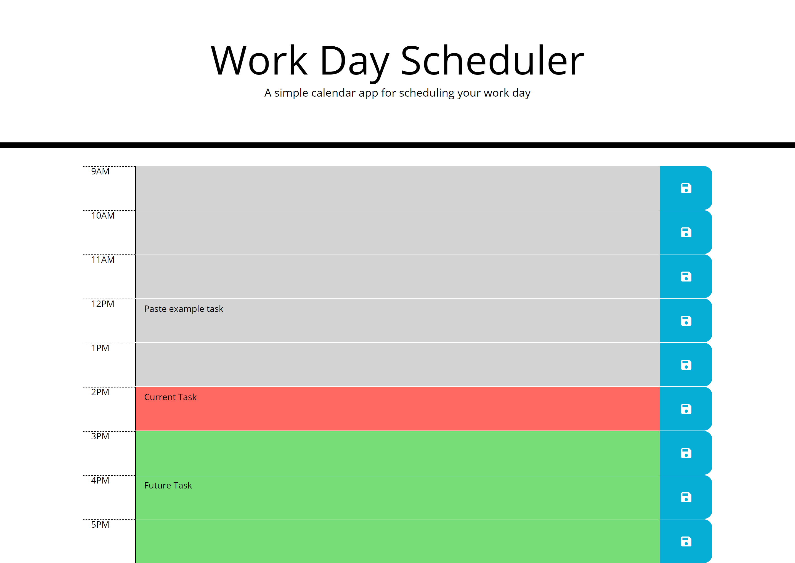

# Work Day Scheduler Starter Code

A simple calendar app for scheduling your work day

Enter your tasks that need done in the time slot it's due. Make sure to hit the save button next to your updated task so that it stays there if you leave or refresh the page!

The color of the scheduler will change as the day progresses - Red is the current time, Green has yet to come, and Gray is what has alreay been passed.

https://hp-adam.github.io/work-day-scheduler/
